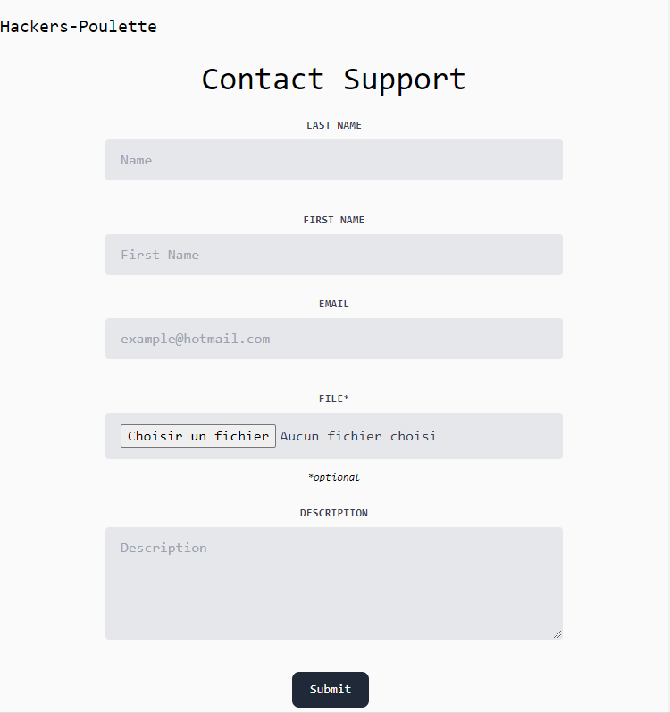

# Hackers Poulette Contact Form

This project is an implementation of a secure contact form for the Hackers Poulette website. The form allows users to submit contact requests by providing their personal information and a message.

## View

## Features

- Server-side validation of form data.
- Protection against spam using the honeypot technique.
- Saves form data in a MySQL database.
- Sends an e-mail confirming receipt (using SwiftMailer).
- Use of the rakit/validation library for data validation.
- Client-side validation with JavaScript for a better user experience.

## Prerequisites

- PHP 5.6 or higher
- MySQL
- Composer (to install dependencies)

## Installation

1. Clone this repository to your local directory :

`git clone https://github.com/votre-utilisateur/hackers-poulette.git`

2. Navigate to the project directory :

`cd hackers-poulette`

3. Install the dependencies by running the following command :

`composer install`

4. Configure the database connection information in the `functions.php` file.

## Usage

1. Import the `database.sql` file into your MySQL database to create the `contact_forms` table.

2. Start a local web server (e.g., with Apache) and ensure that your site is accessible.

3. Access the form page in your browser (e.g., http://localhost/hackers-poulette/index.php)

4. Fill out the form with the required information and submit it.

5. If the form is valid, the data will be saved in the database, and the email adress specified in the email input will receive a confirmation email.

## Contributing

Les contributions sont les bienvenues ! Si vous souhaitez améliorer ce projet, veuillez suivre les étapes suivantes :

1. Fork the repository.
2. Create a branch for your modifications.
3. Make the changes and commit them.
4. Push your modifications to your fork.
5. Open a pull request to this repository.